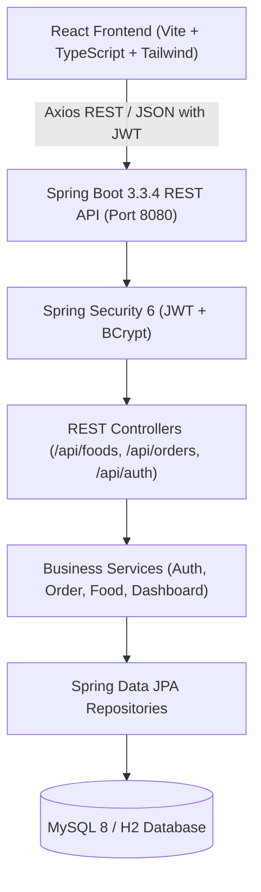

# 🍔 College Canteen Food Ordering System

A full-stack, modern, and user-friendly web application designed for college canteens. Built with **Spring Boot 3 (Java 21)**, **React.js + TypeScript + Vite**, **Tailwind CSS**, and **MySQL 8 / H2**, featuring **JWT Authentication** and **Role-Based Access Control (RBAC)**.

---

## 📌 Project Features

### 👨‍🎓 Student Portal
- **User Authentication**: Secure student registration and login with JWT token handling & password encryption (BCrypt).
- **Food Catalog & Search**: Browse dishes categorized into *Breakfast, Lunch, Fast Food, Snacks, Beverages, Desserts*, with real-time keyword search.
- **Stock Indicators**: Visual badges indicating whether items are *Available (In Stock)* or *Sold Out*.
- **Interactive Shopping Cart**: Add dishes, increase/decrease quantities, remove items, clear cart, and calculate real-time subtotals.
- **Counter Order Placement**: Instant order submission using *Pay-at-Counter* flow with auto-generated unique Order Tokens (e.g. `#ORD2610051025`).
- **Live Order Tracking**: Dynamic 5-stage visual stepper (*Placed &rarr; Confirmed &rarr; Preparing &rarr; Ready for Pickup &rarr; Completed*).
- **Order History**: Review previous orders, check receipts, and cancel placed orders.

### 👨‍🍳 Admin / Canteen Manager Portal
- **Analytics Dashboard**: Live overview of Total Orders, Today's Orders, Total Revenue (₹), Inventory Counts, and Active Student counts.
- **Live Kitchen & Counter Order Management**: Step-by-step order lifecycle progression (*Placed &rarr; Confirmed &rarr; Cooking &rarr; Mark Ready &rarr; Handover*), cancellation, and customer lookup.
- **Food Inventory Management**: Add new dishes, edit pricing, update descriptions, toggle stock availability on/off, and delete items with modal confirmation.
- **Category Management**: Create, edit, and organize canteen menu sections.

---

## 🏗️ System Architecture



---

## 💻 Technology Stack

| Layer | Technologies Used |
|---|---|
| **Frontend** | React 18, TypeScript, Vite, Tailwind CSS, Lucide React Icons, Axios, React Router DOM 6 |
| **Backend** | Java 21, Spring Boot 3.3.4, Spring Security 6, Spring Data JPA, Hibernate, JJWT 0.12.5 |
| **Database** | MySQL 8 (Production & Schema Script) / H2 In-Memory (Zero-setup instant run) |
| **Authentication**| Stateless JWT (JSON Web Tokens) with HS256 algorithm & BCrypt password hashing |

---

## 🔑 Default Credentials for Demo / Testing

| Role | Email | Password | Dashboard URL |
|---|---|---|---|
| **Admin** | `admin@canteen.com` | `admin123` | `http://localhost:5173/admin/dashboard` |
| **Student** | `student@canteen.com` | `student123` | `http://localhost:5173/dashboard` |

> 💡 **Tip**: The login page includes convenient **"Student Demo"** and **"Admin Demo"** quick-fill buttons for fast project presentations!

---

## 🚀 Quick Start Guide

### Prerequisites
- **Java 21** installed (`java -version`)
- **Node.js 18+** installed (`node -v`)
- *(Optional)* **MySQL 8** (The application comes with H2 enabled by default for zero-config 1-click startup, with a full MySQL 8 schema script included).

### Option 1: 1-Click Startup (Windows)
Double-click `start-all.bat` in the project root directory. It will launch both the Spring Boot Backend (Port 8080) and React Vite Frontend (Port 5173).

---

### Option 2: Manual Terminal Startup

#### 1. Start Backend
Open a terminal in the project root:
```powershell
cd backend
..\maven\apache-maven-3.9.6\bin\mvn.cmd spring-boot:run
```
*Backend runs at: `http://localhost:8080`*

#### 2. Start Frontend
Open another terminal:
```powershell
cd frontend
npm install
npm run dev
```
*Frontend runs at: `http://localhost:5173`*

---

## 🗄️ Database Design & MySQL 8 Configuration

The complete database schema script is located at `database/canteen_db_mysql8.sql`.

### Tables Overview
1. `users`: Stores ID, Name, Email, Phone, BCrypt Password, Role (`STUDENT` or `ADMIN`), and Created Date.
2. `categories`: Food groups (Breakfast, Lunch, Fast Food, Snacks, Beverages, Desserts).
3. `food_items`: Dish names, descriptions, prices, image URLs, stock status (`available`), and category FK.
4. `orders`: Order ID, generated Order Number (`ORD...`), User FK, Total Amount, Status, and Timestamp.
5. `order_items`: Line item FKs, Food Item FK, Quantity, Unit Price, and Subtotal.

### Running with MySQL 8 Server:
1. Ensure your local MySQL 8 service is running.
2. Run the script `database/canteen_db_mysql8.sql` in MySQL Workbench or MySQL CLI.
3. Start the backend with the `mysql` profile:
   ```powershell
   ..\maven\apache-maven-3.9.6\bin\mvn.cmd spring-boot:run -Dspring-boot.run.profiles=mysql
   ```

---

## 📡 REST API Reference

### 🔐 Authentication (`/api/auth`)
- `POST /api/auth/register` — Register a new student account
- `POST /api/auth/login` — Authenticate and receive JWT Bearer token
- `GET  /api/auth/me` — Retrieve current authenticated user profile

### 🍽️ Foods (`/api/foods`)
- `GET    /api/foods` — Get list of food items (supports `?categoryId=`, `?search=`, `?availableOnly=true`)
- `GET    /api/foods/{id}` — Get single food details
- `POST   /api/foods` — Add new food item *(Admin only)*
- `PUT    /api/foods/{id}` — Update food item *(Admin only)*
- `PATCH  /api/foods/{id}/toggle-availability` — Toggle in-stock/sold-out *(Admin only)*
- `DELETE /api/foods/{id}` — Delete food item *(Admin only)*

### 📂 Categories (`/api/categories`)
- `GET    /api/categories` — Get all food categories
- `POST   /api/categories` — Create category *(Admin only)*
- `PUT    /api/categories/{id}` — Update category *(Admin only)*
- `DELETE /api/categories/{id}` — Delete category *(Admin only)*

### 🧾 Orders (`/api/orders`)
- `POST /api/orders` — Place a new food order *(Student only)*
- `GET  /api/orders/my-orders` — View logged-in student's order history
- `GET  /api/orders/track/{orderNumber}` — Track order status by token
- `GET  /api/orders` — View all canteen orders *(Admin only)*
- `PUT  /api/orders/{id}/status` — Advance or update order status *(Admin only)*
- `POST /api/orders/{id}/cancel` — Cancel an order

### 📊 Dashboard (`/api/admin/dashboard`)
- `GET /api/admin/dashboard/stats` — Metrics for revenue, orders count, inventory & recent orders *(Admin only)*

---

## 🎓 MCA Viva Questions & Explanations

1. **How does JWT Authentication work in this project?**
   - When a user logs in, Spring Security verifies credentials with `BCryptPasswordEncoder`. If valid, `JwtUtils` generates a cryptographically signed token containing user claims (`email`, `role`, `userId`). The frontend stores this token and sends it in the `Authorization: Bearer <token>` header for subsequent requests. `JwtAuthFilter` validates the signature and populates Spring's `SecurityContextHolder`.

2. **How is Role-Based Authorization enforced?**
   - Endpoints are protected at the Spring Security layer using `SecurityFilterChain` rules and `@PreAuthorize("hasRole('ADMIN')")`. Route guards on the React side (`<ProtectedRoute allowedRole="ADMIN">`) ensure students cannot access admin pages.

3. **How does the shopping cart state persist?**
   - The React `CartContext` synchronizes cart changes with browser `localStorage`, ensuring items remain in the cart even if the page is refreshed.
